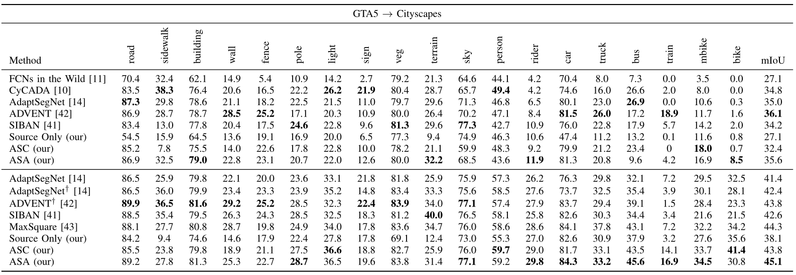
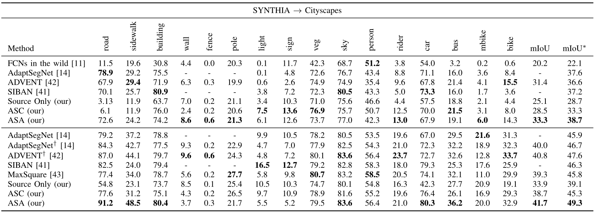

#  Affinity Space Adaptation for Semantic Segmentation Across Domains 
---
Pytorch implementation of the paper ["Affinity Space Adaptation for Semantic Segmentation Across Domains", TIP, 2020](https://arxiv.org/abs/2009.12559). In this paper, we address the problem of unsupervised domain adaptation (UDA) in semantic segmentation, achieving the state-of-the-art performance on standard benchmarks.

## Paper
If you find this paper useful in your research, please consider citing:
```
@ARTICLE{9184275,
  author={W. {Zhou} and Y.{Wang} and J. {Chu} and J. {Yang} and X. {Bai} and Y. {Xu}},
  journal={IEEE Transactions on Image Processing}, 
  title={Affinity Space Adaptation for Semantic Segmentation Across Domains}, 
  year={2020},
  volume={},
  number={},
  pages={1-1},}
```

## Example Results

## Quantitative Reuslts
1. Comparison Results on Cityscapes when adapted from GTA5 in terms of per-class IoU and mIoU over 19 class.

2. Comparison Results on Cityscapes when adapted from SYTNTHIA in terms of per-class IoU and mIoU over 13 or 16 class.


## Usage
### Datasets
* Download the [GTA5 Dataset](https://download.visinf.tu-darmstadt.de/data/from_games/) as source dataset.
* Download the [Cityscapes Dataset](https://www.cityscapes-dataset.com/) as target dataset.
### Initial Weights
Initial weights and trained models can be downloaded from here. [[Google Drive](https://drive.google.com/drive/folders/1F-kmmV89uJK7-IGzeAox3BSkH014GpdL?usp=sharing)] [[Baidu Drive](https://pan.baidu.com/s/1NOKDNWVd5-kd2w0rhzwM_w) (download code: 9lov) ].   
Put the weights in the "ASANet/pretrained" directory.   
### Training Script:
```
bash scripts/train_gta2city.sh
```
### Testing Scripts:
```
bash scripts/evaluate.sh
```
## Contact
Thanks for your attention!
If you have any suggestion or question, you can leave a message here or contact us directly:
- weizhou@hust.edu.cn
- yongchaoxu@hust.edu.cn